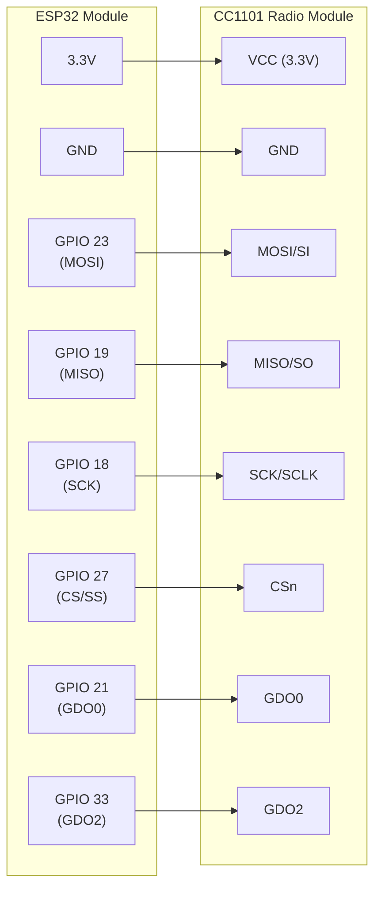

[](https://github.com/matthias-bs/MicroPython-BresserWeatherSensorReceiver/actions/workflows/pylint.yml)
[](https://github.com/matthias-bs/MicroPython-BresserWeatherSensorReceiver/actions/workflows/pytest.yml)
[](https://github.com/matthias-bs/MicroPython-BresserWeatherSensorReceiver/releases)
[](https://github.com/matthias-bs/MicroPython-BresserWeatherSensorReceiver/blob/main/LICENSE)

# MicroPython-BresserWeatherSensorReceiver
Bresser 5-in-1/6-in-1/7-in-1 868 MHz Weather Sensor Radio Receiver for MicroPython using [Texas Instruments CC1101](https://www.ti.com/product/CC1101)

Tested with [MicroPython](https://micropython.org/) v1.27.0 on ESP32

## Hardware Connection

The following diagram shows the wiring between the ESP32 and the CC1101 radio module:



**Note:** Pin assignments are defined in [src/config.py](src/config.py) and use the [ESP32's VSPI (SPI ID 2) hardware interface](https://docs.micropython.org/en/latest/esp32/quickref.html#hardware-spi-bus). The SPI pins (MOSI, MISO, SCK) are the hardware-defined defaults for VSPI on ESP32.

## Installation

### Prerequisites

* [MicroPython](https://micropython.org/) v1.27.0 or later installed on your ESP32
* CC1101 radio module connected to your ESP32 as described in the [Hardware Connection](#hardware-connection) section

### Installation Steps

1. **Copy the source files to your MicroPython device:**
   
   Copy all files from the `src/` directory to your ESP32:
   - `BresserDecoder.py` - Decoder implementations for all supported Bresser sensor types
   - `cc1101.py` - CC1101 radio module driver
   - `config.py` - Hardware configuration (pin assignments)
   - `main.py` - Example implementation

   You can use tools like [mpremote](https://docs.micropython.org/en/latest/reference/mpremote.html), [ampy](https://github.com/scientifichackers/ampy), [rshell](https://github.com/dhylands/rshell), or [Thonny IDE](https://thonny.org/) to transfer files to your device.

2. **Configure hardware pins (if needed):**
   
   If your hardware setup differs from the default pin assignments, edit `config.py` on your device to match your wiring.

3. **Customize the implementation:**
   
   **Important:** The provided `main.py` is an example implementation that demonstrates how to receive and decode Bresser weather sensor data. It is intended as a starting point for your own application-specific implementation.
   
   You should customize `main.py` based on your requirements, such as:
   - Integration with other sensors or systems
   - Data logging or storage
   - Network connectivity (WiFi, MQTT, etc.)
   - Power management
   - Error handling and recovery

4. **Run the application:**
   
   Once the files are copied and configured, you can run the receiver by executing:
   ```python
   import main
   main.main()
   ```
   
   Or reset your ESP32 if `main.py` is set to run automatically on boot.

## Supported Bresser Sensor Protocols

* **6-in-1 Decoder**
  * 6-in-1 weather sensors (temperature, humidity, UV, wind, rain)
  * Soil moisture/temperature sensors
  * Pool/spa thermometer
    
* **5-in-1 Decoder**
  * 5-in-1 weather sensors
  * Professional Rain Gauge
    
* **7-in-1 Decoder**
  * 7-in-1/8-in-1 weather sensors
  * Air Quality (PM) sensor
  * CO2 sensor
  * HCHO/VOC sensor
    
* **Lightning Sensor Decoder**
  * Lightning sensor
    
* **Leakage Sensor Decoder**
  * Water Leakage sensor


**Sequential Decoder Fallback** -- main.py tries all decoders in sequence until one succeeds

## Example Console Output

```
TTTTTTTTTTTTTTTTTTTTTTTTTTTTTTTTTTTTTTTTTTTTTTTTTTTTTTTTT
--- RSSI: -82.0 dBm ---
TTTTTTTTTTTTTTTTT
--- RSSI: -72.5 dBm ---
Soil Moisture Sensor: ID: 0x52828827  Type: 4  Channel: 1  Battery: OK  Startup: No
  Temperature: 24.5°C  Moisture: 0%
TTTTTTTTTTTTTTTTTTTTTTTTTTTTTTTTTTTTTTTT
```

* Each 'T' marks a message reception timeout
* RSSI: Received Signal Strength Indicator
* Common sensor data and sensor type specific measurement values
* Only an RSSI value without subsequent data: unknown or invalid message (message integrity check failed)


## Legal

> This project is in no way affiliated with, authorized, maintained, sponsored or endorsed by Bresser GmbH or any of its affiliates or subsidiaries.
