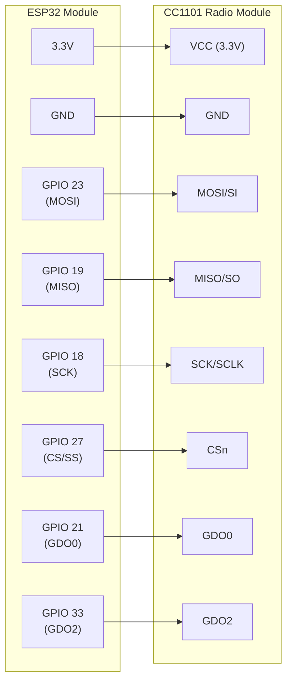

# MicroPython-BresserWeatherSensorReceiver
Bresser 5-in-1/6-in-1/7-in-1 868 MHz Weather Sensor Radio Receiver for MicroPython using [Texas Instruments CC1101](https://www.ti.com/product/CC1101)

Tested with [MicroPython](https://micropython.org/) v1.27.0 on ESP32

## Hardware Connection

The following diagram shows the wiring between the ESP32 and the CC1101 radio module:



**Note:** Pin assignments are defined in [src/config.py](src/config.py) and use the [ESP32's VSPI (SPI ID 2) hardware interface](https://docs.micropython.org/en/latest/esp32/quickref.html#hardware-spi-bus). The SPI pins (MOSI, MISO, SCK) are the hardware-defined defaults for VSPI on ESP32.

## Supported Bresser Sensor Protocols

* **6-in-1 Decoder**
  * 6-in-1 weather sensors (temperature, humidity, UV, wind, rain)
  * Soil moisture/temperature sensors
  * Pool/spa thermometer
    
* **5-in-1 Decoder**
  * 5-in-1 weather sensors
  * Professional Rain Gauge
    
* **7-in-1 Decoder**
  * 7-in-1/8-in-1 weather sensors
  * Air Quality (PM) sensor
  * CO2 sensor
  * HCHO/VOC sensor
    
* **Lightning Sensor Decoder**
  * Lightning sensor
    
* **Leakage Sensor Decoder** :heavy_check_mark: -- Fully ported
  * Water Leakage sensor


**Sequential Decoder Fallback** -- main.py tries all decoders in sequence until one succeeds

## Example Console Output

```
TTTTTTTTTTTTTTTTTTTTTTTTTTTTTTTTTTTTTTTTTTTTTTTTTTTTTTTTT
--- RSSI: -82.0 dBm ---
TTTTTTTTTTTTTTTTT
--- RSSI: -72.5 dBm ---
Soil Moisture Sensor: ID: 0x52828827  Type: 4  Channel: 1  Battery: OK  Startup: No
  Temperature: 24.5°C  Moisture: 0%
TTTTTTTTTTTTTTTTTTTTTTTTTTTTTTTTTTTTTTTT
```

* Each 'T' marks a message reception timeout
* RSSI: Received Signal Strength Indicator
* Common sensor data and sensor type specific measurement values
* Only an RSSI value without subsequent data: unknown or invalid message (message integrity check failed)


## Legal

> This project is in no way affiliated with, authorized, maintained, sponsored or endorsed by Bresser GmbH or any of its affiliates or subsidiaries.
